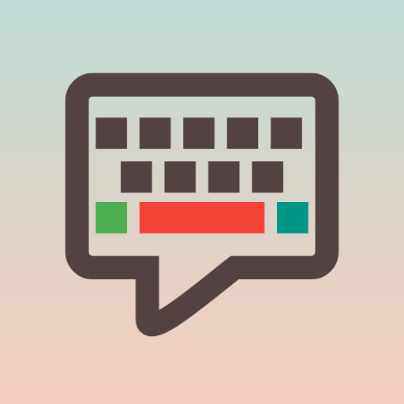

# Sayboard

This project provides a voice keyboard using [Vosk](https://alphacephei.com/vosk/android).
It is based on [https://github.com/Felicis/vosk-android-demo](https://github.com/Felicis/vosk-android-demo).

This app requires a Vosk model to run. You can use the built-in downloader or download manually from
[https://alphacephei.com/vosk/models](https://alphacephei.com/vosk/models), and then import into the app.

## Permissions
Sayboard uses for the following permissions:
- INTERNET - to download the models. This permission is not required, and can be revoked through the device settings in compatible ROMs.
**Sayboard does not, and never will, send any of your information over the internet!**.
- RECORD_AUDIO - well, this is a voice keyboard after all.
- POST_NOTIFICATIONS - to show download and import progress.
- FOREGROUND_SERVICE - to download and import models in the background, and for the RecognitionService.
- FOREGROUND_SERVICE_MICROPHONE - for the RecognitionService.
- FOREGROUND_SERVICE_SPECIAL_USE - for the download service.
- QUERY_ALL_PACKAGES - do to bug in Android, this permission is required for a speech RecognitionService to work properly (see https://github.com/Kaljurand/K6nele-service/issues/9).

## Screenshot

Screenshot of Sayboard:

https://github.com/ElishaAz/Sayboard/assets/26592879/58f1421e-0e10-488f-a7fa-4aa702f1cee2

Note: prior to commit [Multiple language support!](https://github.com/ElishaAz/Sayboard/commit/9d61c774e6eb623c2b8603a85a5bd73d98ab9af1),
this repository had another gradle model named `models`. As it is large and not needed anymore, I removed it from git history.
If you want to use any earlier commits, you can find it [here](https://github.com/Felicis/vosk-android-demo/tree/master/models).
